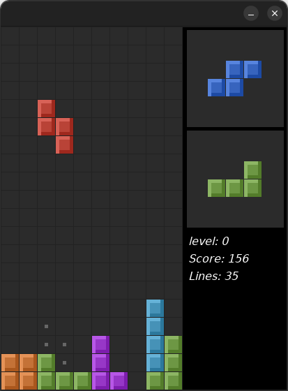

# tetris-Au3
A simple Tetris game made in AutoIt

This was my first game i made in AutoIt back in 2013.

The main focus were to have a low CPU usage game, and to understand game mechanics better.

### Controls

| Key         | Action                   |
| ----------- | ------------------------ |
| Up Arrow    | Rotate Counter-Clockwise |
| Left Arrow  | Move Left                |
| Down Arrow  | Drop: Soft               |
| Right Arrow | Move Right               |
| Space       | Drop: Hard               |
| Left Shift  | Hold piece               |
| Esc         | Exit game                |
